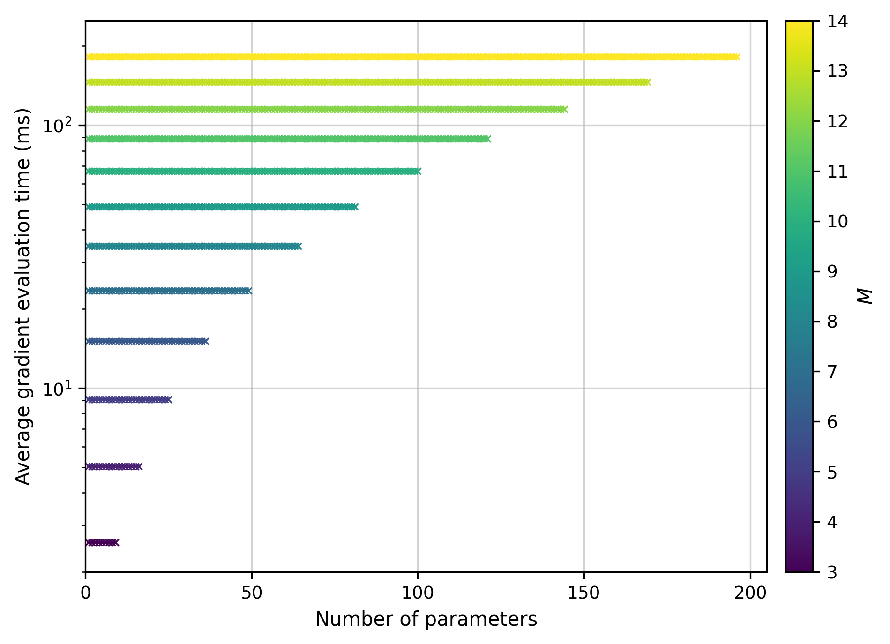
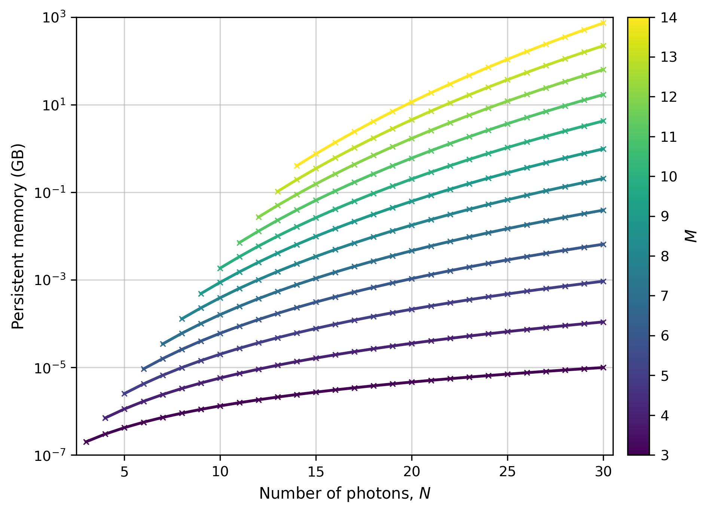

# esQueranto

**esQueranto** is a JAX-based framework for the differentiable simulation and optimization of quantum experiments.

The source code is not currently public. Nevertheless, we present its computational performance on a simple reference task whose mathematical definition is fully specified: optimizing a parameterized optical circuit to rediscover a discrete Fourier-transform unitary.

The results illustrate two important computational aspects of differentiable quantum simulation:

- the time required to evaluate gradients;
- the GPU memory required to represent and manipulate multiphoton quantum states.

## Fourier-transform reconstruction

We consider a rectangular Clements interferometer acting on `M` optical modes [1].

The interferometer contains:

```text
M(M - 1) / 2
```

generalized beam splitters. Each beam splitter is controlled by two real parameters, and the circuit includes `M` additional output phases.

The total number of real optical parameters is therefore:

```text
2 × M(M - 1) / 2 + M = M²
```

The objective is to optimize the circuit unitary `U(theta)` so that it reproduces the `M`-dimensional discrete Fourier transform `F_M`, whose matrix elements are:

```text
(F_M)[j,k] = exp(2 pi i j k / M) / sqrt(M)
```

for `j, k = 0, ..., M - 1`.

The loss is the normalized squared Frobenius distance between the generated and target unitaries:

```text
L(theta) = ||U(theta) - F_M||²_F / (2M)
```

The task is deliberately simple: its purpose is not to demonstrate a new optical design, but to provide a controlled benchmark of the differentiable simulation.

## Gradient-evaluation time

We measure the time required to evaluate the loss and its gradient while varying:

- the number of modes `M`;
- the number of trainable optical parameters.

JAX uses reverse-mode automatic differentiation to compute the gradient of a scalar loss. The different components of the gradient are obtained through a common backward pass, rather than through an independent circuit evaluation for every parameter.

Together with JIT compilation and accelerator-oriented array operations, this explains why increasing the number of trainable parameters does not produce a proportional increase in evaluation time.

The dominant increase is instead associated with `M`, since larger interferometers contain more optical elements and require larger forward and backward computations.

<p align="center">
  
</p>

<p align="center">
  <em>
    Figure 1. Average gradient-evaluation time as the number of trainable
    parameters increases. Each curve corresponds to a different number of
    optical modes M.
  </em>
</p>

The approximately flat curves show that, for a fixed circuit size, evaluating additional gradient components introduces comparatively little overhead. This behavior is specific to the adopted JAX implementation and should not be interpreted as a universal parameter-independent scaling law.

## Multiphoton state-space growth

Evaluation time is not the only computational limitation. As the number of photons increases, GPU memory can become the dominant constraint.

For exactly `N` indistinguishable photons distributed among `M` optical modes, the possible kets are occupation-number states of the form:

```text
|n_1, n_2, ..., n_M>
```

subject to:

```text
n_1 + n_2 + ... + n_M = N
```

The number of possible kets is:

```text
D(N,M) = binomial(N + M - 1, N)
```

Each ket is represented by:

- `M` occupation numbers stored as `int32`;
- one complex amplitude stored as `complex128`.

An `int32` value requires 4 bytes, so the occupation vector of one ket requires:

```text
4M bytes
```

A `complex128` amplitude requires:

```text
16 bytes
```

The persistent memory required for one ket is therefore:

```text
4M + 16 bytes
```

The total persistent memory required to store the complete quantum state is:

```text
B_persistent(N,M)
    = D(N,M) × (4M + 16) bytes
```

or, explicitly:

```text
B_persistent(N,M)
    = binomial(N + M - 1, N) × (4M + 16) bytes
```

In decimal gigabytes:

```text
B_persistent_GB(N,M)
    = binomial(N + M - 1, N) × (4M + 16) / 10^9
```

<p align="center">
  
</p>

<p align="center">
  <em>
    Figure 2. Theoretical persistent memory required to store all fixed-N
    Fock states, assuming M int32 occupation numbers and one complex128
    amplitude for every ket.
  </em>
</p>

This estimate includes only the persistent representation of the quantum state: the stored occupation vectors and their amplitudes.

The actual peak GPU memory is higher. Simulated quantum operations may temporarily create additional states, transformed amplitudes, index arrays, masks, and other intermediate quantities. Reverse-mode differentiation also requires values and cotangents from the forward computation to be retained or recomputed during the backward pass.

Peak memory therefore depends not only on `N` and `M`, but also on the sequence of quantum operations, the differentiation procedure, and the compiler's memory-management strategy.

The persistent-memory curve should consequently be interpreted as a theoretical baseline rather than as the total GPU memory required to execute the simulation.

## References

[1] W. R. Clements, P. C. Humphreys, B. J. Metcalf, W. S. Kolthammer, and I. A. Walmsley,  
“Optimal design for universal multiport interferometers,”  
*Optica* **3**, 1460–1465 (2016).  
[https://doi.org/10.1364/OPTICA.3.001460](https://doi.org/10.1364/OPTICA.3.001460)

[2] J. Bradbury et al.,  
“JAX: Composable transformations of Python and NumPy programs,” 2018.  
[https://github.com/jax-ml/jax](https://github.com/jax-ml/jax)

[3] JAX Developers,  
“Automatic differentiation,” *JAX Documentation*.  
[https://docs.jax.dev/](https://docs.jax.dev/)

## Citation

To reference esQueranto, please cite:

> Artificial Scientist Lab, *esQueranto: A differentiable tool for the
> simulation and optimization of quantum experiments*, GitHub repository,
> 2026.  
> https://github.com/artificial-scientist-lab/esQuerantoWeb
